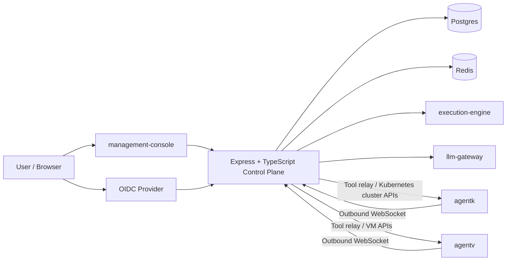

# Control Plane Architecture

The control plane is the authoritative backend for:

1. user auth and sessions
2. workspace and target-core identity
3. Kubernetes and VM target lifecycle, agent registration, and command routing
4. troubleshooting sessions and run state
5. execution-engine orchestration
6. run-scoped gateway token issuance

Kubernetes clusters and Linux/systemd virtual machines are active target types. The persistence and shared workflow core use targets, while Kubernetes-specific lifecycle, namespace scope, and pod logs stay under `/kubernetes-clusters` APIs and VM-specific lifecycle, host inventory, metrics, and logs stay under `/virtual-machines` APIs. Shared MCP, session, and run paths remain target-scoped and capability-driven.

## High-Level Diagram

## Detailed Diagram

```mermaid
flowchart TD
    subgraph Entry[HTTP Entry]
        App[app.ts]
        AuthRoutes[routes/auth.ts]
        WorkspaceRoutes[routes/workspaces.ts]
        SessionRoutes[routes/sessions.ts]
        RunRoutes[routes/runs.ts]
        InternalRoutes[routes/internal-execution.ts]
    end

    subgraph Controllers[Controllers]
        AuthCtrl[auth-controller.ts]
        WorkCtrl[workspaces-controller.ts]
        SessionCtrl[sessions-controller.ts]
        RunCtrl[runs-controller.ts]
        InternalCtrl[internal-execution-controller.ts]
    end

    subgraph Services[Services]
        EEClient[execution-engine-client.ts]
        Coordination[control-plane-coordination.ts]
        TokenSvc[token-service.ts]
        MCPRegistry[mcp-registry-client.ts]
        ToolSync[kubernetes-cluster-tool-sync.ts]
        VMToolSync[virtual-machine-tool-sync.ts]
        MCPSeed[development-mcp-seed.ts]
    end

    subgraph AgentGateway[Agent Bridge]
        WSServer[agent/ws-server.ts]
        JsonRpc[types/jsonrpc.ts]
    end

    subgraph Auth[Auth Layer]
        OIDCMod[auth/oidc.ts]
        SessionMod[auth/session.ts]
        Middleware[auth/middleware.ts]
    end

    subgraph State[Persistence + Runtime]
        Repo[store/repository.ts]
        Runtime[store/runtime.ts]
        DB[(Postgres)]
        Redis[(Redis)]
    end

    subgraph External[External Dependencies]
        UI[management-console]
        OIDC[Dex / Keycloak / External OIDC]
        EE[execution-engine]
        GW[llm-gateway]
        Agent[agentk]
        VMAgent[agentv]
    end

    UI --> App
    App --> AuthRoutes
    App --> WorkspaceRoutes
    App --> SessionRoutes
    App --> RunRoutes
    App --> InternalRoutes

    AuthRoutes --> AuthCtrl
    WorkspaceRoutes --> WorkCtrl
    SessionRoutes --> SessionCtrl
    RunRoutes --> RunCtrl
    InternalRoutes --> InternalCtrl

    AuthCtrl --> OIDCMod
    AuthCtrl --> SessionMod
    AuthCtrl --> Middleware

    WorkCtrl --> Repo
    WorkCtrl --> ToolSync
    WorkCtrl --> VMToolSync
    WorkCtrl --> MCPRegistry
    WorkCtrl --> TokenSvc

    SessionCtrl --> Repo
    SessionCtrl --> Runtime
    SessionCtrl --> EEClient

    RunCtrl --> Repo
    RunCtrl --> Runtime

    InternalCtrl --> Repo
    InternalCtrl --> Runtime
    InternalCtrl --> Coordination
    InternalCtrl --> TokenSvc

    Repo --> DB
    Coordination --> Redis
    Runtime --> Redis

    WSServer --> JsonRpc
    WSServer --> Repo
    WSServer --> Runtime
    WSServer --> Coordination

    OIDC --> OIDCMod
    EEClient --> EE
    MCPRegistry --> GW
    Agent --> WSServer
    VMAgent --> WSServer
    UI -->|SSE / REST| App
```

## Primary Responsibilities

1. expose public APIs for auth, workspaces, targets, Kubernetes clusters, virtual machines, sessions, and runs
2. persist authoritative platform state in Postgres and short-lived runtime state in Redis
3. coordinate multi-pod control-plane HA through Redis-backed agent ownership, command routing, run event fanout, and renewed scheduler leases
4. mint and expose run-scoped auth material for downstream gateway access
5. dispatch runs to execution-engine and ingest events and final commits
6. maintain the outbound-only websocket bridge for target agents
7. persist raw Kubernetes and VM snapshots and materialize latest resources, findings, summaries, and metrics for indexed browser-facing list APIs

## Workflow Execution Model

Workflows are the only runnable automation aggregate. Agents are reusable
specialist capability profiles; they contribute pinned instructions, tools,
skills, MCP installations, context grants, and policy, but never own or start a
run.

Every executor invocation is a `workflow_runs` row attached to one
`workflow_executions` occurrence:

- a direct Workflow has one root `specialist` run with a pinned Agent snapshot;
- a coordinated Workflow has one root `coordinator` run with a versioned,
  code-owned coordinator profile and no Agent identity;
- delegated work is a child `specialist` run whose `parent_run_id` identifies
  the coordinator root and whose delegation call ID provides idempotency.

Rootness is topology (`parent_run_id IS NULL`), not an executor role. Only a
root may finalize the execution and append the final assistant message.
Coordinator runs receive only internal delegate and await functions. Child
specialist scopes are compiled as least-privilege intersections of the pinned
Workflow authorization envelope, the selected Agent snapshot, one semantic
capability, and one exact target binding.

Root retries create a new root attempt and child graph. Approval continuation
resumes the same run. Cancellation traverses every nonterminal run in the
execution graph. All roles use the same Workflow dispatch, bootstrap, event,
approval, continuation, context, skill, commit, and run-token contracts.

## Module Boundaries

- `routes/workspaces/workspace-routes.ts` registers workspace, member, invitation, and workspace issue routes.
- `routes/workspaces/target-routes.ts` registers shared target summary and target-scoped read routes.
- `routes/workspaces/kubernetes-cluster-routes.ts` registers Kubernetes-specific lifecycle, inventory, pod-log, tool, MCP, and agent-key routes.
- `routes/workspaces/virtual-machine-routes.ts` registers VM-specific lifecycle, inventory, metrics, logs, and agent-key routes.
- `controllers/workspaces/target-tool-controller.ts` validates target type before serving shared target-scoped tool and MCP catalog reads.
- `controllers/workspaces/kubernetes-cluster-*` and `store/repository-kubernetes-*` own Kubernetes-specific projection, settings, snapshots, and MCP behavior.
- `controllers/workspaces/virtual-machine-controller.ts` and `store/repository-virtual-machines.ts` own VM-specific projection, host snapshots, and VM lifecycle behavior.
- `store/repository-workspaces.ts` owns workspace deletion and cleans up generic target-owned rows across target types.
- `store/repository-target-inventory.ts` owns low-level writes to shared target inventory, finding, and target-neutral summary rows. Generic rows use neutral placement/count fields such as `location` and `inventory_count`; Kubernetes-specific node names, namespace counts, and resource-kind counts are projected by `store/repository-kubernetes-inventory.ts`.
- `store/repository-target-tools.ts` owns `target_tool_overrides` access so shared target routes and Kubernetes routes do not depend on Kubernetes repository modules for generic tool state.
- `store/repository-target-agent-registrations.ts` owns target agent registrations and derives `targetType` from `targets`; Kubernetes sync and handshake paths must explicitly require `targetType = "kubernetes"` before invoking cluster-specific behavior.
